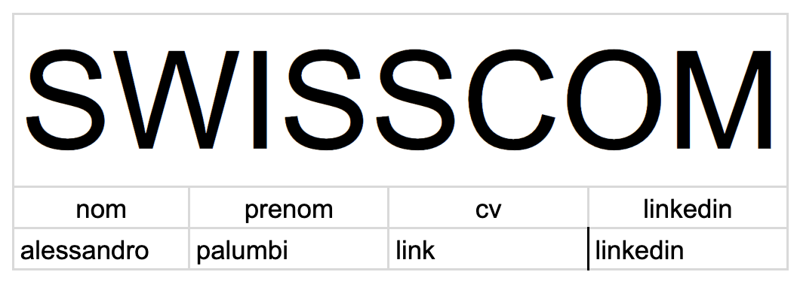

# Readme pour les fichiers Google Sheets

## 1. exemple_ep_forms.csv

### Description
Ce fichier Google Sheet est utilisé pour recueillir les informations des entreprises participant à l'événement de recrutement. Il contient des données telles que le nom de l'entreprise, les créneaux horaires choisis pour leur présence, et le nombre de recruteurs présents.

### Structure du fichier
- **Horodateur** : Date et heure de la soumission du formulaire.
- **Adresse e-mail** : E-mail de la personne soumettant le formulaire.
- **Nom de l'entreprise** : Nom de l'entreprise participante.
- **Nous serons présents** : Indique les créneaux (matin, midi, soir) choisis par l'entreprise.
- **Combien de recruteurs/euses seront présent.e.s le Jour J** : Nombre de recruteurs présents, ce qui détermine le nombre d'étudiants qu'ils peuvent rencontrer. Chaque recruteur peut voir 7 étudiants, donc le nombre total d'étudiants rencontrés dépend du nombre de recruteurs présents (max 3 recruteurs, soit 21 étudiants par entreprise).

### Exemple de sortie du CSV

blablabla

03/02/2024 11:56:23, eric.holzer.lsn@gmail.com, SWISSCOM, matin, 2

03/02/2024 11:58:41, alessandro@palumbi.ch, MUTUEL, matin, midi, soir, 3

03/02/2024 11:59:58, eric.holzer.lsn@gmail.com, BCN, midi, 1

exemple visuel du sheet :

## 2. dp.csv

### Description
Ce fichier Google Sheet est utilisé pour planifier les rendez-vous entre les étudiants et les entreprises. Il organise les créneaux horaires pour chaque entreprise.

### Structure du fichier
- **Entreprise** : Noms des entreprises en haut de chaque colonne.
- **Créneaux horaires** : Heure de chaque rendez-vous (ex : 09:00, 09:15, etc.).
- **Noms des recruteurs** : Indique quel recruteur de l'entreprise sera disponible à chaque créneau horaire.

### Exemple de sortie du CSV

Username,Name,Surname,Linkedin,Cv,Slot1,Slot2,Slot3,Slot4,Slot5,Slot6,Slot7,Slot8,Slot9,Slot10,Slot11,Slot12,Slot13,Slot14,Slot15,Slot16,Slot17,Slot18

jdoe,John,Doe,https://www.linkedin.com/in/johndoe,https://example.com/cv/johndoe,SWISSCOM,,,,MUTUEL,BCN,,,,,,,,,,,,

apalumbi,Aless,Pal,https://www.linkedin.com/in/johndoe,https://example.com/cv/johndoe,,SWISSCOM,,,MUTUEL,BCN,,,,,,,,,,,,

eloser,Eric,Loser,https://www.linkedin.com/in/johndoe,https://example.com/cv/johndoe,,,,,,,,,,,,,MUTUEL,,,,,BCN

exemple visuel du sheet :

## 3. [Nom de l'entreprise].csv (ex : SWISSCOM.csv)

### Description
Ce fichier est un exemple de rendu final pour une entreprise spécifique (ici, SWISSCOM) sous forme de PDF. Il contient les détails des candidats rencontrés par les recruteurs de l'entreprise.

### Structure du fichier
- **Nom** : Nom de l'étudiant.
- **Prénom** : Prénom de l'étudiant.
- **CV** : Lien vers le CV de l'étudiant.
- **LinkedIn** : Lien vers le profil LinkedIn de l'étudiant.

### Exemple de sortie du CSV

nom entrpise

nom, prenom, cv, linkedin

alessandro, palumbi, link, linkedin

Ces fichiers sont essentiels pour organiser et planifier efficacement l'événement de recrutement, en assurant une bonne communication entre les entreprises et les étudiants.

exemple visuel du sheet :
